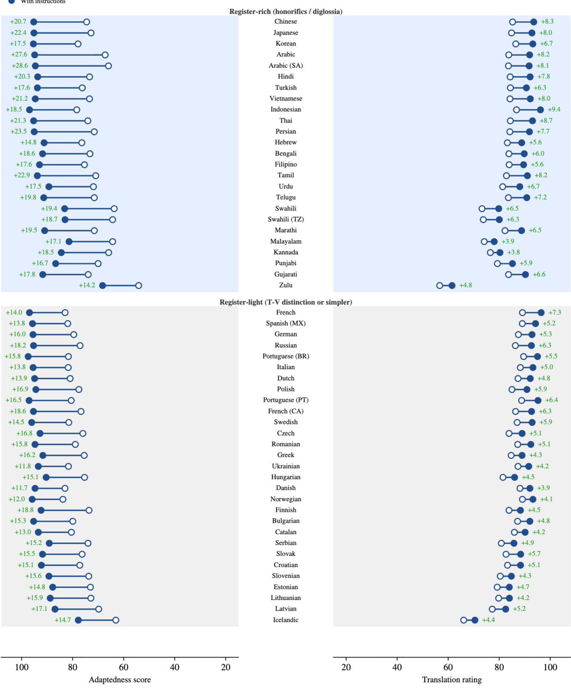

# LLM 연구 아이디어 노트 - Register Richness

- Register-rich languages (Arabic,Japanese) show the largest adaptedness gains (+20–28), ahead of register-light languages (French, Italian, Dutch; +13–16). 
    - [Beyond "To whom it may concern": Tailoring MT to Audience and Intent](https://arxiv.org/abs/2606.03259) p.15

- Register richness (언어 안에 사회적 관계 (상하, 격식 정도)가 많이 표현되어 있는 정도)
    - Register highest to lowest: 한국어 > 독일어 > 영어
    - 꽉박사님한테 무슨 언어로 말하느냐에 따른 {behavior, instruction following, ???} 연구
    - {} 는 추후 논의 필요
    - 감정분류 classification을 한국어의 지독한 예의범절 level 관점에서 연구해봐도 괜찮을듯 (외국 학회에서 먹힐진 모르겠지만... 한국 학회 노리기) 
        - 여기서 Label 뽑아서 나중에 꽉박사님 행동에 쓰는거임
        - 혹은 "예의범절의 정도 label"을 in-context vector로 믹스해서 프롬프트 기반 in-context learning 대비 효과를 대비해보는건 어떨까 

## discussion w/ Prof. Choi

- 브레인 스토밍을 하는 것은 좋음
- 허나 브레인 스토밍을 하고 나서 명확하게 정리를 해야 (특허를 쓰듯이! - 누가 봐도 명확하게 이해하게 (AI 적극 활용)) 
    - 연구 정의, 목적 구체화
    - 기존 연구와의 차별성

## discussion w/ Astra

### 목표와 연구 방향

- **2026-10-21까지: 학부 프로젝트 수준의 실험 완성.** 작은 데이터와 소수 모델로 재현 가능한 비교 실험을 수행하고, 결과·실패 사례·후속 연구 계획을 발표한다.
- **2026-12-16까지: 국내학회 논문을 목표로 발전.** 1차 결과에서 연구 질문을 좁히고, 데이터 검증·비교 방법·오류 분석을 보강해 논문 초안과 발표본을 완성한다. 실제 투고 학회와 마감은 별도로 정한다.
- 공손성별 성능 비교·공손성 분류·ICV 제어에는 가까운 선행연구가 있다. **1단계는 선행연구 재현과 작은 확장도 의미가 있고, 2단계는 구체적인 차별성을 확보하는 단계**로 잡는다.
- 추천 흐름: **말투에 따른 행동 선택 비교 → 높임말 형식과 실제 의도의 혼동 분석 → 분리된 정보를 활용한 행동 선택 개선**.
- 꽉박사님과의 연결은 우선 텍스트 기반 행동 선택으로 구현한다. 실물 로봇 연결은 후속 데모로 두어 실험 일정이 배송에 의존하지 않게 한다.

### 가까운 선행연구와 차별성

2026-09-16에 확인한 연구 기준. 아래 평가는 검색 범위에 근거하며, 동일 연구가 전혀 없음을 보장하지는 않는다.

| 연구 | 주요 내용 | 우리 연구에서 고려할 점 |
| --- | --- | --- |
| [Should We Respect LLMs? — SICon 2024](https://arxiv.org/abs/2402.14531) | 영어·중국어·일본어의 프롬프트 공손성과 과제 성능 비교 | 언어·공손성별 성능 비교 자체는 기존 연구가 있음 |
| [Are large language models affected by politeness? — PACLIC 2024](https://aclanthology.org/2024.paclic-1.86/) | 한국어 요청의 공손성 5단계에 따른 4개 모델의 정확도·친절성 평가 | 1단계의 핵심 참고 논문. 최신 모델이나 독일어 추가는 재현·확장 성격 |
| [TyDiP — Findings of EMNLP 2022](https://aclanthology.org/2022.findings-emnlp.420/) | 한국어를 포함한 9개 언어의 공손성 3분류 데이터 | 라벨 생성 자체보다 세분화의 필요성과 활용 효과가 중요 |
| [Too Polite to be Human — SICon 2025](https://aclanthology.org/2025.sicon-1.6/) | 한국어 대화의 위계·친밀도·감정에 따른 공감 판단 평가 | 사회적 관계와 감정을 함께 다루는 방향도 이미 연구됨 |
| [In-context Vectors — ICML 2024](https://proceedings.mlr.press/v235/liu24bx.html) | 활성값 기반 스타일 제어, ICL 비교, 벡터 조합 | 공손성 변환과 safe − polite 조합 사례가 있어 단순 적용만으로는 신규성이 약함 |
| [Can language models process linguistic deference? — SCiL 2026](https://aclanthology.org/2026.scil-main.35/) | 한국어 주체 높임법의 표면 형식과 사회적 맥락 이해 평가 | 형식·맥락 구분을 행동 선택에 미치는 영향으로 구체화할 필요 |
| [LoCar — ACL Industry 2026](https://aclanthology.org/2026.acl-industry.148/) | 차량 에이전트의 한국어 높임말 제어와 대화 전략 평가 | 에이전트 적용 자체보다 구체적인 오류 원인·개선 효과가 중요 |
| [Beyond Toxic Positivity — CAS @ LREC 2026](https://aclanthology.org/2026.cas-1.21/) | 심리적 거리와 주제의 감정적 무게에 따라 대화 전략 조절 | 관계·감정 정보를 이용한 반응 조절도 비교 대상이 됨 |

- ICV 논문의 공손성 변환은 주로 정성적 사례이고, 주요 정량 평가는 격식·감정 등의 스타일 변환이다. 한국어의 세밀한 제어를 정량 평가할 여지는 있으나, 벡터 조합 자체를 새로운 방법으로 주장하지 않는다. [원문 §3.3·§4.2·Table 5](https://arxiv.org/html/2311.06668)
- 한국어 문맥 기반 비꼼 탐지에는 [KoCoSa — LREC-COLING 2024](https://aclanthology.org/2024.lrec-main.864/)도 있어, ‘존댓말인데 부정적인 문장 분류’만으로는 차별성이 부족하다.

### 출발점에서 구분할 개념

- 인용 논문의 **+20–28은 번역의 adaptedness(청중·목적·어조 적합도, 0–100점) 상승**이다. 일반적인 instruction-following이나 로봇 행동 성능 상승을 뜻하지 않는다. [원문 Appendix C](https://arxiv.org/html/2606.03259v1)
- **한국어 > 독일어 > 영어는 검증된 정량 순위가 아니라 가설**로 둔다. 원 논문 Figure 6의 register 그룹 내부 순서는 자원량 기준이다. 언어별 성능 차이에는 학습 데이터량·기본 언어 능력·번역 품질 등이 함께 작용할 수 있다.
- **높임말 형식, 문맥상 공손성, 감정, 발화 의도, 사회적 관계를 구분한다.** 해체·해요체·하십시오체를 보편적인 예의 점수의 순서로 간주하지 않는다.
- 예: 친구에게 “야, 진짜 고마워”는 반말이어도 감사이고, 실수한 상대에게 비꼬는 “참 잘하셨네요”는 높임말이어도 불만이다. 제안을 거절하는 “괜찮습니다”에서는 거절 의도를 파악해야 한다.
- 이번 프로젝트의 우선 출력은 **적절한 행동 선택**으로 정하고, 공손성·의도 라벨은 그 판단을 돕는 중간 정보로 검토한다. 감정분류까지 모두 독립적인 과제로 개발하지 않는다.

### 1단계: 10월 21일까지의 학부 프로젝트

**연구 질문:** 같은 과제와 의도를 전달할 때, 요청의 말투·격식 변화가 LLM의 행동 선택 정확도에 영향을 주는가?

- **범위:** 한국어 중심 실험 + 독일어 데이터 처리 수업을 위한 독일어 보조 실험. 영어·일본어까지 동시에 확장하지 않는다.
- **과제:** 상황과 요청을 읽고 왼쪽 회전, 오른쪽 회전, 정지, 확인 질문 등의 제한된 행동 중 하나를 선택한다. 행동 종류와 정답 기준은 파일럿 후 고정한다.
- **데이터 초안:** 한국어 기본 상황 60–100개에 말투 변형 3개를 구성한다. 그중 20–30개 상황은 독일어 du/Sie 등으로 구성한다. 한국어 80개 × 말투 3개 × 모델 2개 + 독일어 30개 × 격식 2개 × 모델 2개라면 기본 실행은 약 600회이다. 검수 인원과 예산에 맞춰 조정한다.
- **통제:** 상황·요청 내용·출력 형식은 고정하고 말투만 바꾼다. 사람이 의도가 같고 표현이 자연스럽다고 확인한 쌍만 비교한다. 독일어도 원어민 또는 숙련자 검수를 거치며, 두 언어의 격식 표현을 같은 공손성 단계로 단순 대응시키지 않는다.
- **모델:** 접근 가능한 서로 다른 계열의 모델 2개로 시작한다. 모델 버전, 시스템 프롬프트, 생성 설정을 기록한다.
- **평가:** 동일 모델 안에서 말투별 행동 정확도, 동일 의도에 대한 행동 일관성, 출력 형식 준수율을 비교한다. 언어 간 절대 성능만으로 register richness의 효과를 주장하지 않는다.
- **산출물:** 데이터와 검수 기준, 실행·평가 코드, 조건별 결과표, 대표 오류 사례, 한계와 2단계 계획.
- **완료 기준:** 재현 가능한 실험과 설명 가능한 결과. 말투 효과가 작거나 없어도 결과로 보고하며, 유의한 차이가 나올 때까지 조건을 바꾸지 않는다.

독일어 격식 대조 자료는 [CoCoA-MT](https://aclanthology.org/2022.findings-naacl.47/)를 참고할 수 있다. 번역 데이터이므로 행동 선택 과제의 상황·정답은 별도로 설계한다.

### 2단계: 12월 16일까지의 국내학회 수준 발전

**연구 질문 후보:** 높임·격식 표지와 실제 의도가 일치하지 않는 상황에서 LLM은 어떤 행동 오류를 보이며, 형식과 의도를 분리한 정보를 제공하면 그 오류가 줄어드는가?

- **10/21 결과를 보고 초점을 확정한다.** 반복되는 오류 유형 한두 개를 선택한다. 1단계가 거의 만점이면 단순 요청 과제의 한계로 보고, 문맥이 필요한 요청·거절·확인 상황을 별도 탐색한다.
- **데이터 보강:** 기본 상황 200–300개 정도를 출발 목표로 두되 검수 가능한 규모를 우선한다. 한국어를 본 실험으로, 독일어를 보조 검증으로 유지한다.
- **대조쌍:** 의도는 같고 말투만 다른 쌍에서는 행동 일관성을, 발화는 같고 문맥에 따라 의도가 달라지는 쌍에서는 적절한 행동 변경을 평가한다.
- **라벨과 검수:** 최소한 언어 형식과 발화 의도를 분리하고, 관계·친밀도는 필요한 상황 정보로 기록한다. 최소 2명이 독립적으로 검토하고 합의도·불일치 사례를 보고한다. 정답이 여러 개일 수 있으면 허용 행동 집합이나 확인 질문 기준을 정한다.
- **비교 방법:** 일반 프롬프트, 예시 기반 ICL, 형식·의도 라벨 제공 방식. 정답 라벨을 준 경우와 모델이 예측한 라벨을 준 경우를 구분해 정보의 잠재적 효과와 실제 분류 오류를 나눠 본다.
- **개선 원인 분석:** 형식 정보만, 의도 정보만, 둘 다 제공하는 조건을 비교한다. 필요하면 단순 공손성 점수 제공 방식도 추가한다.
- **평가:** 행동 정확도·의도 분류 성능, 말투 변화에 따른 행동 일관성, 문맥 변화에 대한 적응을 따로 측정한다. 응답이 더 공손해졌다는 것만으로 행동이 개선됐다고 판단하지 않는다.
- **재현성과 분석:** 같은 기본 상황의 변형이 학습·개발·평가에 흩어지지 않게 분리한다. 평가 데이터로 프롬프트를 조정하지 않고, 상황 단위 신뢰구간과 오류 유형별 결과를 보고한다.
- **논문 기여 목표:** 검수된 대조 데이터, 재현되는 오류 현상, 강한 ICL 기준선과 비교한 개선 효과 또는 개선이 어려운 조건에 대한 분석. 모델 수·데이터 수를 늘리는 것만으로 기여를 대신하지 않는다.

**ICV는 선택 확장으로 둔다.** 먼저 프롬프트·라벨 방식으로 효과를 확인하고, 시간과 연산 자원이 남을 때 내부 활성값에 접근 가능한 모델에서 비교한다. 분류 라벨 자체가 ICV는 아니며 제어 벡터는 모델의 활성값에서 추출해야 한다. 같은 기본 모델·예시를 사용해 행동 정확도, 의미 보존, 제어 성공률·지연시간을 비교한다. ICV까지 수행하지 않아도 2단계 연구가 완결되도록 설계한다.

### 실행 일정 초안

| 기간 | 목표 | 완료 기준 |
| --- | --- | --- |
| 9/16–9/27 | 핵심 선행연구 읽기, 행동·정답 기준 정의, 10–20개 상황 파일럿 | 의미가 같은 말투 변형과 평가 코드가 작동함 |
| 9/28–10/11 | 한국어 데이터 확장, 독일어 보조 자료 검수, 모델 2개 실험 | 조건별 결과와 주요 오류 사례 확보 |
| 10/12–10/21 | 결과 분석, 재현 방법 정리, 1차 발표 | 학부 프로젝트 실험과 후속 연구 질문 제시 |
| 10/22–11/8 | 질문 확정, 대조 데이터·라벨 기준 보강 | 국내학회 연구의 범위와 비교 방법 고정 |
| 11/9–11/29 | 본 실험, 라벨별 효과 분석, 통계·오류 분석 | 평가 데이터에서 핵심 주장 검증 |
| 11/30–12/16 | 필요한 보완 실험, 논문 초안·발표본 작성 | 근거와 한계를 갖춘 연구 결과물 완성 |

- 국내학회 수준을 목표로 하더라도 단순 재현만으로 충분하다고 가정하지 않는다. 12월에는 데이터·분석·개선 중 어떤 기여를 입증했는지 명확히 한다.
- 한국어라는 소재가 국제학회에 부적합한 것은 아니다. 페르시아어의 의례적 공손성을 다룬 [TaarofBench 연구는 EMNLP 2025 본회의](https://aclanthology.org/2025.emnlp-main.94/)에 발표됐다. 이번 일정에서는 국내학회 수준의 결과물을 우선 완성하고 이후 확장 여부를 판단한다.
